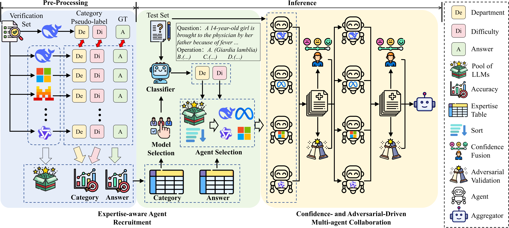
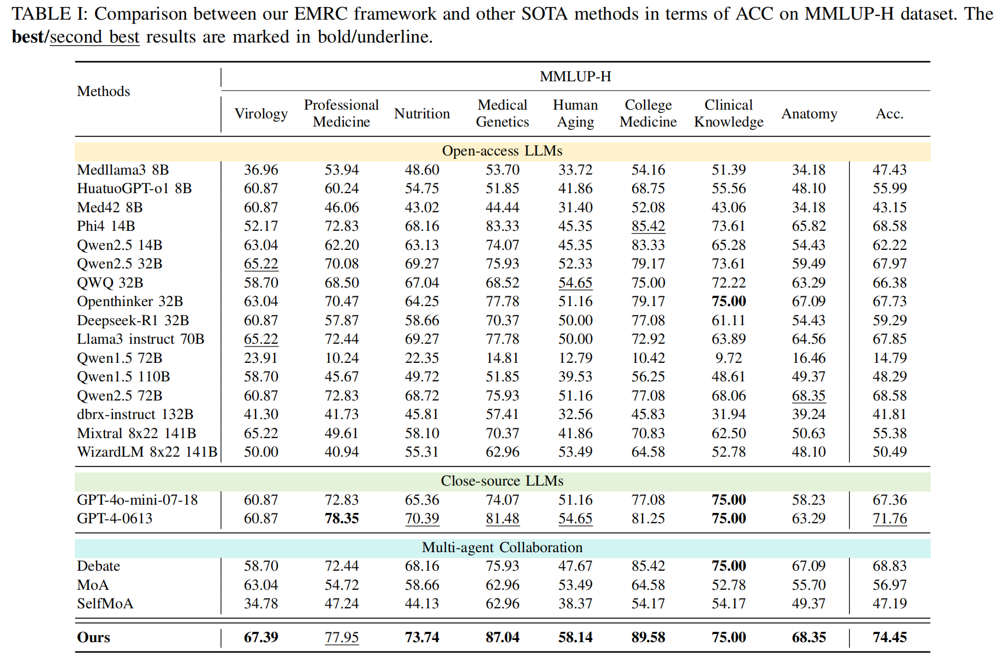
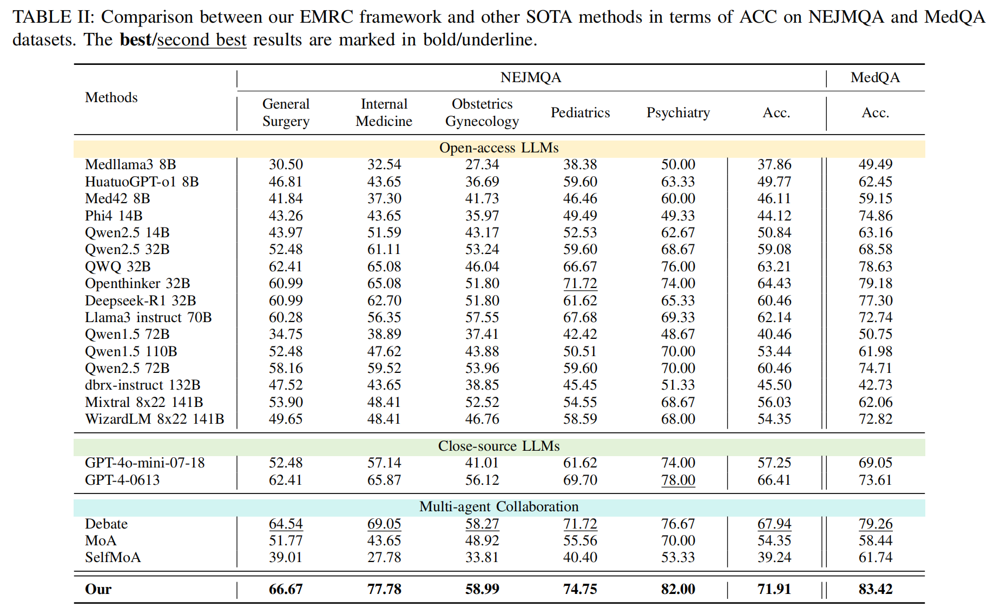
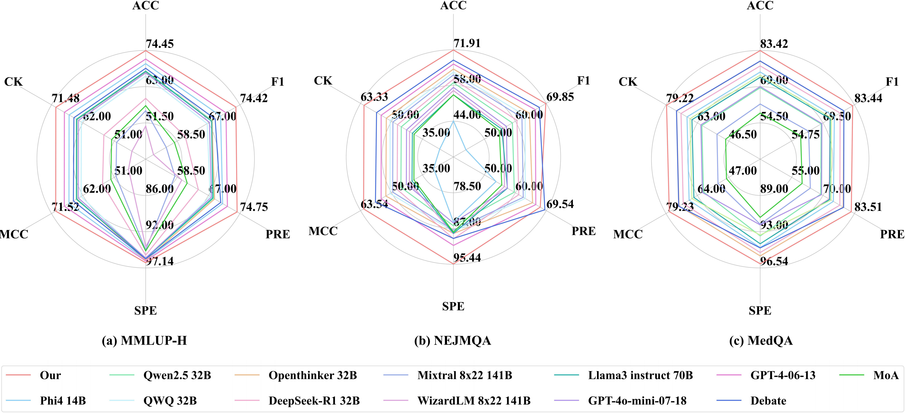
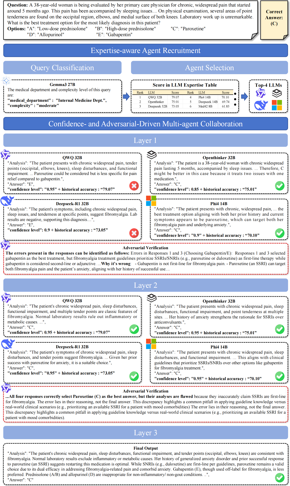

# EMRC

This repo is an official implementation of the *EMRC*.
**The complete code will be released upon the acceptance of the paper.**

## Framework Overview

This paper introduces the Expertise-aware Multi-LLM Recruitment and Collaboration (EMRC) framework, which enhances medical decision-making by dynamically selecting and integrating multiple specialized large language models (LLMs). The framework features an expertise-aware agent recruitment strategy, which evaluates the strengths of various LLMs across medical domains, and a confidence- and adversarial-driven collaboration mechanism, refining the responses through iterative validation. These contributions improve diagnostic accuracy and reliability, offering a robust solution for AI-assisted medical decision support systems.
## Comparison




## Case Study


## Prerequisites
Install [Camel](https://github.com/camel-ai/camel) and [Ollama](https://ollama.com/)
```
pip install camel-ai
```
```
curl -fsSL https://ollama.com/install.sh | sh
```


## Usage
### 1. Clone the repository
```
https://github.com/Lx-Bao/EMRC.git
```
### 2. Pre-Processing
```
python Pre_Processing/Expertise_Evaluation.py
```
### 3. Inference
First, classify the medical questions:
```
python Inference/Query_Classfication.py
```
Next, based on the classification results, employ agents and collaborate to obtain the final answer.
```
python Inference/evaluate_WorkFlow_nej.py
```

### 4. Evaluation

## Citation

